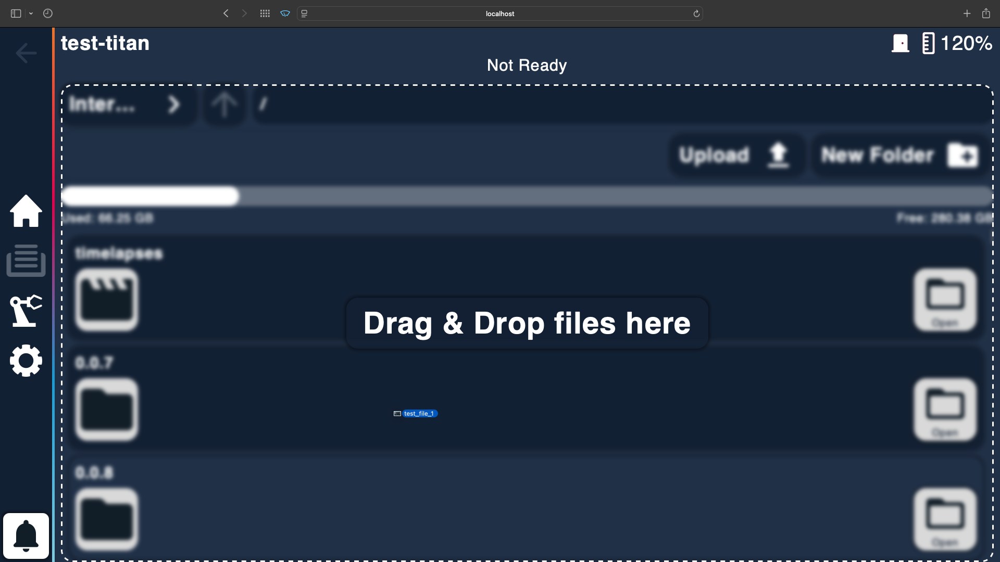
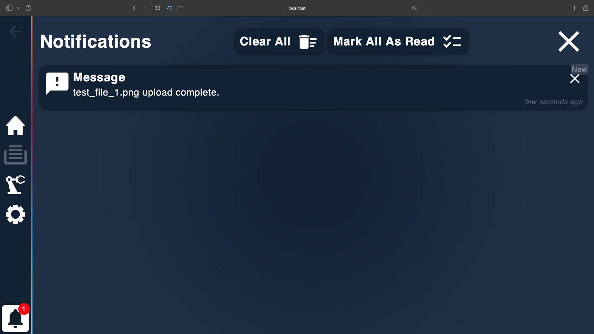
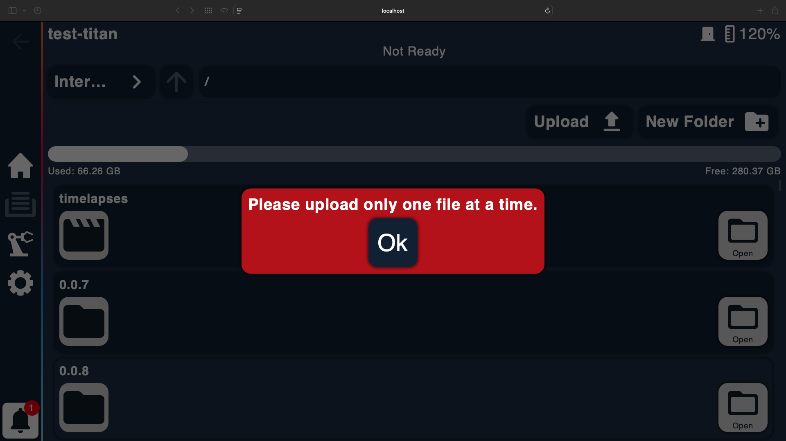
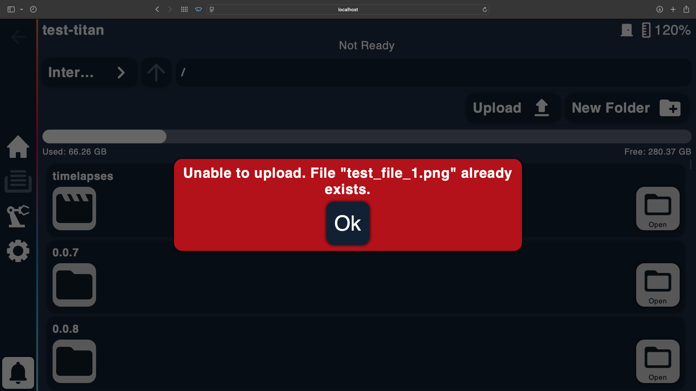

# File Upload Component (Crystalliser UI)

This code snippet is part of a file upload feature for the embedded UI of Photocentric's crystalliser 3D printer.

It allows users to upload a single file either via drag-and-drop or by selecting a file manually. The component ensures that only one file is uploaded at a time and displays error messages when needed. Upload progress is shown using modals, and the UI prevents uploading when chosen to be disabled.

## Features

- Drag-and-drop file uploading
- Manual file selection
- Error handling for:
  - Uploading multiple files at once
  - Uploading duplicate files
- Hover zone UI feedback
- Modal system for success and error feedback

## Technologies

- Angular
- TypeScript
- HTML / SCSS

## Code Snippet

The full logic can be found in [`src/file-upload.ts`](src/file-upload.ts)

## Screenshots

**Dropzone Hover Effect**

**Upload Success Modal**

**Multi-File Error Modal**

**Duplicate File Error Modal**

